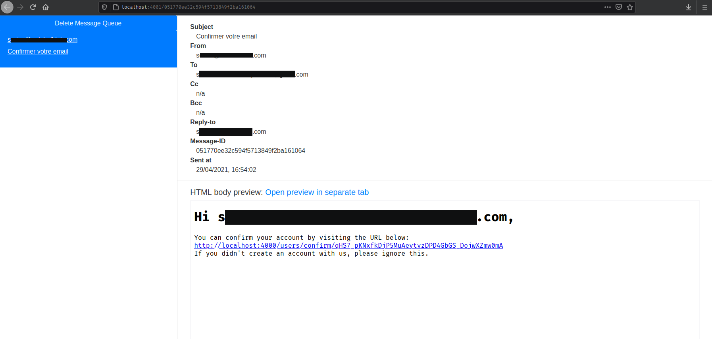

# PasswordFlow

## What is included in this POC

* login essentials : signup, signin, reset_password, update_password, update_email
* verified by email : any critical action is verified by email.
* email sending with [Swoosh](https://github.com/swoosh/swoosh)
* email templating with eex (as phoenix templates)
* email preview : instead of really sending them to a recipient, send it to RAM

## Email preview
Swoosh provide a way to send mail to RAM rather than to a mail server. It's useful for developing the mail template without destroying API credits.



To do so, in `mix config.exs`, you just have to do :

```elixir
config :password_flow, PasswordFlow.Mailer,
  adapter: Swoosh.Adapters.Local
config :swoosh, serve_mailbox: true, preview_port: 4001
```

and in router :

```elixir
if Mix.env == :dev do
  scope "/dev" do
    pipe_through [:browser]

    forward "/mailbox", Plug.Swoosh.MailboxPreview
  end
end
```

As a final note, using the runtime.exs config file, we would be able to swich to any Adapter without compiling.


## Master template
I created a `layout/email.html.eex` file. It's the master email template which would be use to style all the emails.

## Invokation
It's fairly simple, see `user_notifier.ex`.


```elixir
new()
  |> to(to)
  |> from("an-email@yopmail.com")
  |> reply_to("an-email@yopmail.com")
  |> subject("Réinitialiser votre mot de passe")
  |> put_view(PasswordFlowWeb.UserResetPasswordView)
  |> render_body("email_reset_instructions.html", %{ user: user, url: url})
  |> Mailer.deliver()
```

## Sync or Async

You can choose if you want the email to be part of the calling process or to be run inside a Task. See `PasswordFlow.Mailer` in `mailer.ex` (just using a Task, really).

## Opinion

On a personnal note, I found Swoosh super simple to use and everything was working in minutes. Phoenix.Swoosh (what brings the eex rendering) is ok but what disturbs me is that it makes the `lib/` dependant on the `web/` (needs views and template) and on Phoenix code. But pragmatically, I guess it's ok since it does not make the lib dependent on having a running phoenix server : it just need the code (proved by sending mail through iex while phoenix server was off). 

## Test it on your machine

To start your Phoenix server:

  * Install dependencies with `mix deps.get`
  * Create and migrate your database with `mix ecto.setup`
  * Install Node.js dependencies with `yarn install` inside the `assets` directory
  * Start Phoenix endpoint with `mix phx.server` and add some steroids with `iex -S mix phx.server` to repl into it.

Now you can visit [`localhost:4000`](http://localhost:4000) from your browser.

Ready to run in production? Please [check our deployment guides](https://hexdocs.pm/phoenix/deployment.html).
